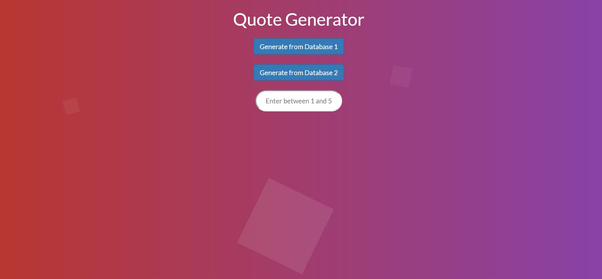

# Quote-Generator Project

#Random Quotes

The quotes are generated randomly one by one with each JavaScript call.  

Each quote is a combination of at least 3 sentence fragments with a beginning, middle, and end)  

Select the number of quotes to be generated (between 1 and 5) 

Choose between 2 types of quote generators  

Once the quotes are generated, have the program generate new quotes or quit the program  

